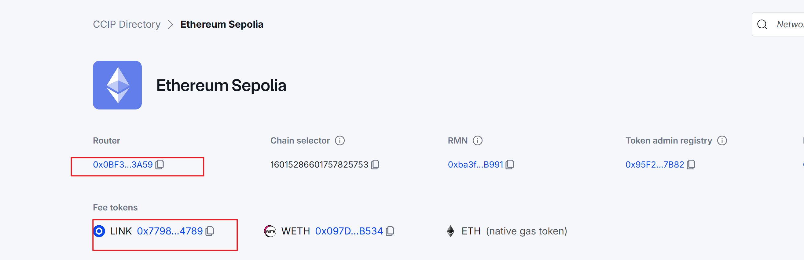
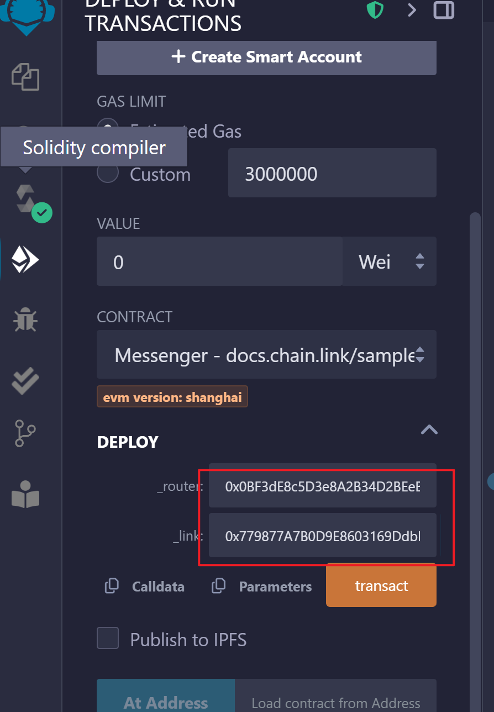
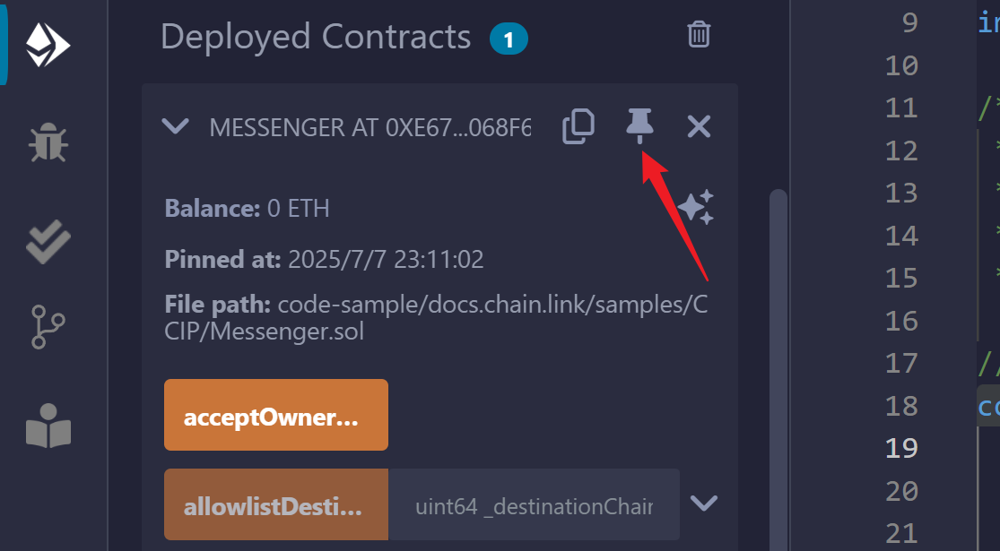
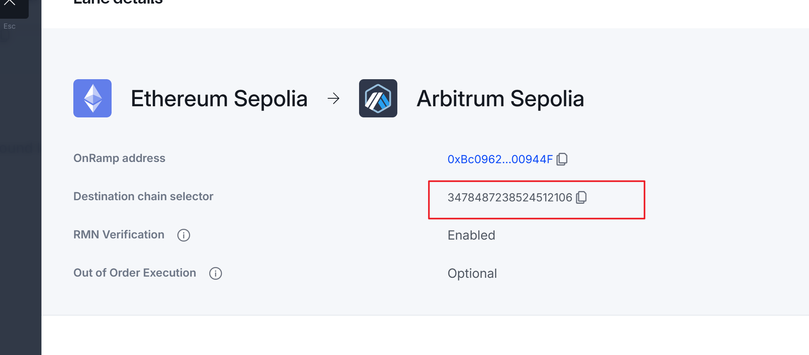
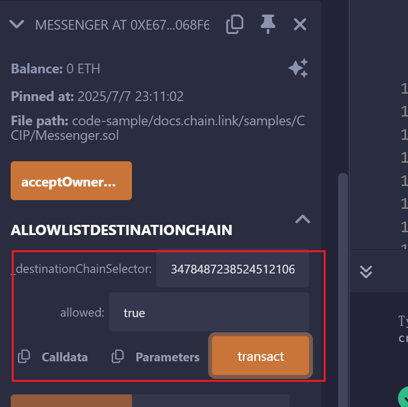
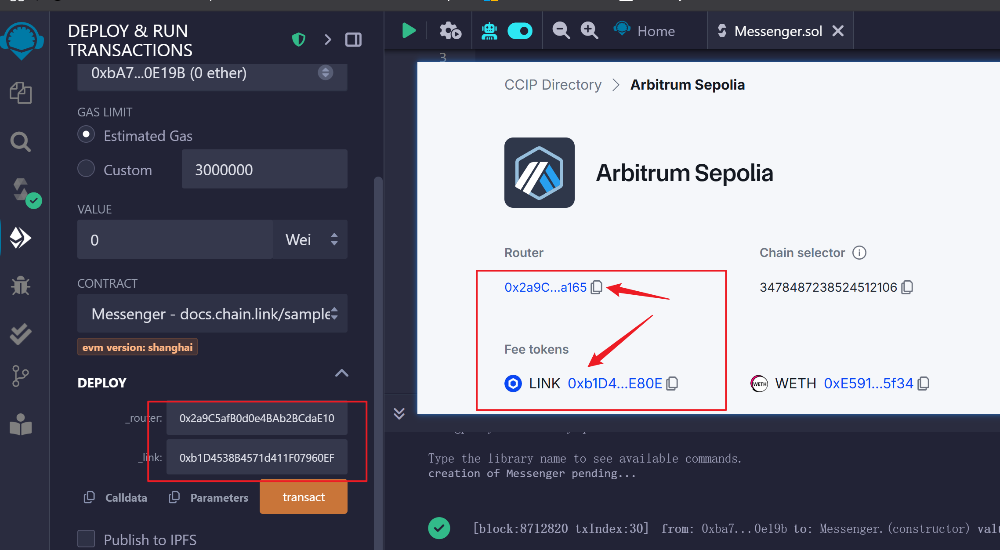
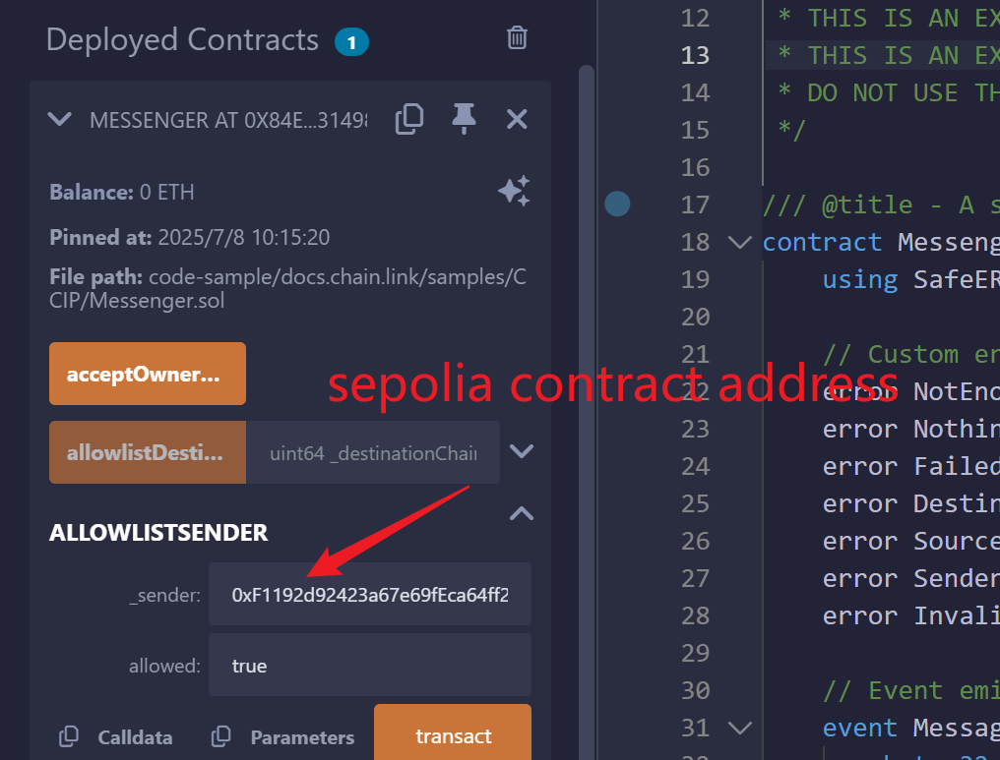
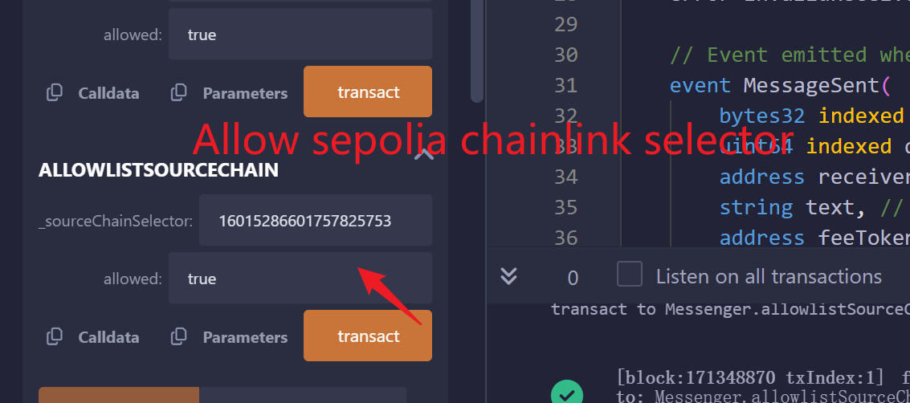
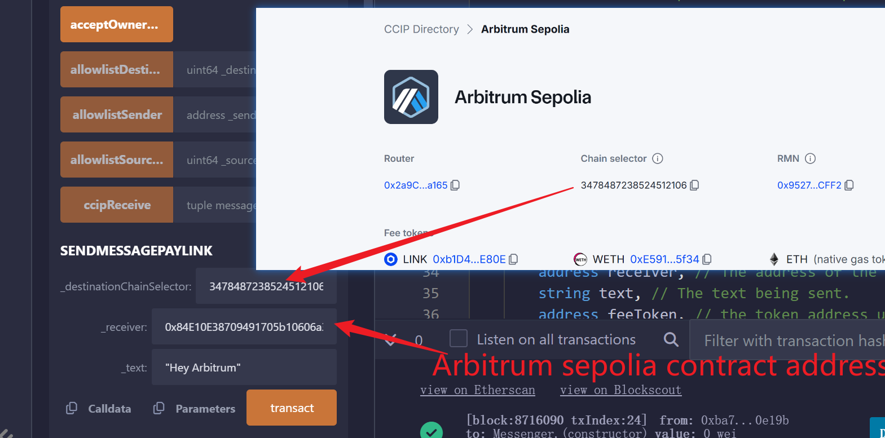
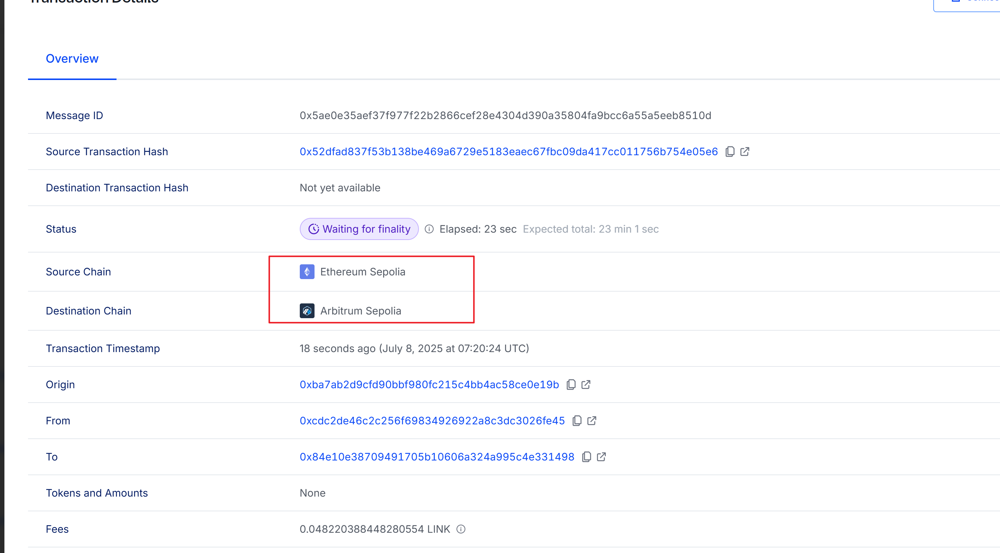

# CrossChainRebaseToken
1. A protocol that allows user to desposit into a vault and in return, receiver rebase tokens that represent their underlying balance.
2. Rebase token -> balanceOf function is dynamic to show the changing balance with time.
- Balance increase linearly with time
- mint tokens to our users every time they perform an anction(minting,burning,transferring,or... bridging)
3. Interest rate
- Indivually set an interest rate or each user based on some global interest rate of the protocol at the time the user deposits into the value
- This global interest rate can only decrease to incetivise/reward early adopters

## Understanding Chainklink CCIP: The Internet of Contrancts
Chainlink CCIP, which stands for CrossChain Interoperability Protocol, is a powerful standard for enabling seamless  communication,data tranfer, and token movements between different chain networks.

## Chainlink  DONS 
chainkik Decentralized Oracle Networks
The core infrastructure of Chainlink,consisting of independent oracle node operators 
Responsible for monitoring, validating, and relaying messages between chains

## Router Contract
The primary smart contract that users and applications interact with on each blockchain to initiate and receive CCIP messages and token tranfer

## OnRamp Contract
A smart contract on the source chain that validates outgoing messages, messages token locking/buring,and interacts with the Commiting DON

## OffRamp Contract
A smart contract on the destination chain that validates incoming messages, manages token unlocking/minting, and is called by the Executing DON

## ccip address docs link
https://docs.chain.link/ccip/directory/testnet/chain/ethereum-testnet-sepolia

## ccip Tutorial docs
https://docs.chain.link/ccip/tutorials/evm/send-arbitrary-data

## pin the contract for the current workspace

## Arbitrum Sepolia Destination chain selector

Delpoy contract on Arbitum Sepolia

https://sepolia-faucet.pk910.de/#/

https://bridge.arbitrum.io/?destinationChain=arbitrum-sepolia&sourceChain=sepolia

https://ccip.chain.link/#/side-drawer/msg/0x5ae0e35aef37f977f22b2866cef28e4304d390a35804fa9bcc6a55a5eeb8510d

## Pool Contract

https://docs.chain.link/ccip/concepts/cross-chain-token/evm/token-pools#standard-token-pools

https://github.com/smartcontractkit/chainlink-ccip/blob/contracts-ccip-release/1.6.0/chains/evm/contracts/pools/TokenPool.sol

